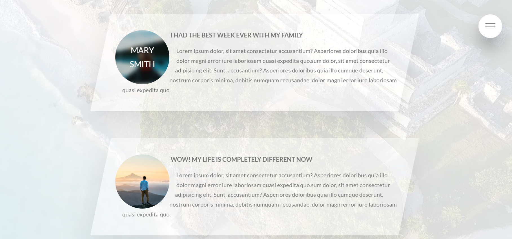

# Natours

_**What is Natours project ?** Natours is a tour website for tourist and who want to travel. You can choose the tour which fits your schedule and budget.You can visit the site by clicking the link &rarr; [Natours](https://natours-gldn.netlify.app/) ._

### What did I learn while coding this project ?

_In this project I learned creating a lot of various animation.I compiled all scss files with running scripts. Troughout all project I learn how to write code with SCSS and I love it 👌. Also I practiced BEM (Block Element Modifier)._

> #
>
> - _What is Saas, Sassy CSS (SCSS)? ,_
> - _declaring Sass variables and how nesting use,_
> - _7-1 folder pattern,_
> - _using calc() function,_
> - _how to use linear-gradient() function on background-image,_
> - _positioning ::before and ::after pseudo-element with position:absolute,_
> - _how animation is defined with @keyframes,_
> - _transform property with scale(), rotate(), skew(), translateY() functions,_
> - _create linear-gradient heading with color:transparent and -webkit-background-clip:text property,_
> - _according to clicking radio's label whether is shown ::after element,_
> - _using of clip-path and shape-outside properties,_
> - _using of outline property,_
> - _centering fixed item with top, left and transform properties,_
> - _how to create trapezoid background-image with clip-path propert,_
> - _adding blur with backdrop-filter to element's back,_
> - _selecting all child element with adjecent selector,_
> - _filter property with blur(), brightness() functions,_
> - _formatting selecting text with ::selection pseudo-element,_
> - _control to browser with @supports testing whether supporting these features,_
> - _with checkbox and opacity, visibility property set element to disappear,_
> - _with background-size, background-image, background-position adding transition feature to navigation item_
> - _how to media queries is written according to desktop first approach,_
>
> #

 
 

 
 

 
 

 
 

 
 

 
 

 
 

 
 

 
 

 
 

 
 

 
 

 
 

 
 

 
 

 
 

 
 

